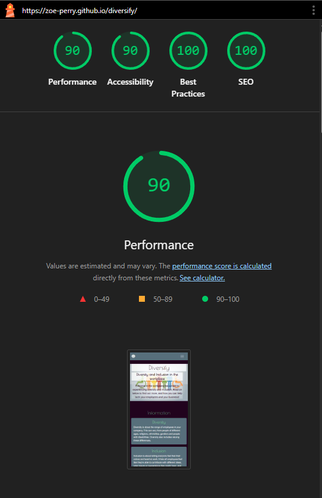

# Diversify

### Link to Live Website
https://zoe-perry.github.io/diversify/

## Table of Contents

1. User stories
2. UX Design
    1. Wireframes
    2. Colours and Fonts
3. Features
4. Deployment and Dependencies
5. AI Implementation
6. Testing and Validation
7. Reflections
8. Credits
9. References
    1. Content References

## User stories

- As the site owner, I need easy navigation and a user-friendly, appealing design, so users can find information quickly and efficiently in a pleasant to read manner on any device.

- As a visitor to the site, I want the information presented to me to be clear, concise, and organised, so I don't have to struggle to find what I'm looking for.

- As a user I want links to be clear and easy to identify so I can quickly access any additional resources.

- As a visitor to the site I want information easy to access and read, with key points highlighted in a list for me to find them easily so I can swiftly find what I'm looking for.

## UX Design
### Wireframes
#### Mobile Wireframe

#### Tablet Wireframe

#### Desktop Wireframe

For design I began with my wireframes, starting with mobile and allocating space to each section while determining how I'd like to lay it out. I then worked my way up to ensure that appropriate space was taken up by each section as the website expanded onto larger devices.

### Colours and fonts

I began with looking for colours that would suit my website using the site 'coolors'. I experimented with a couple and ultimately landed on the selection shown above. I felt these were accessible and combined well. In the final product I ensured these were added as variable elements at the beginning of my css document so that during testing if issues arose I could easily swap the colours around without having to manually change every instance of the colour.

In the website I selected two fonts, mostly to allow headings to stand out. I ended selecting 'Roboto Flex' and 'Poiret One' from google fonts, as I felt they were easy enough to read, both being a Sans Serif font, whilst also different enough to allow for variation on my page.

## Features

1. A navbar allowing for quick movement to any element on the page
2. A header section containing a background image, title, subtitle, and introductory segment
3. A section containing cards which contain information
4. A section containing a list
5. A section containing cards comprised of buttons that link to external websites and small amounts of text
6. A footer

## Deployment and Dependencies

The website has been deployed through Github Pages. It requires no additional applications to be ran.

## AI Implementation

I was unsure as to why my navbar had no background colour after applying a style to it, so highlighted my html code to see if it could locate any problems. This didn't help as I had highlighted the wrong part of my code, as my styles would be in my css document.

I then selected my css code to see if copilot could locate the issue, and found that I had forgotten to add the targetted ID to my navbar for the styles to be applied.

I was struggling to make my cards all the same size in my information section, and asked copilot. It offered a solution of applying a height to all cards, however in the past I have found this can cut off content on certain devices if the content takes up more space than the fixed size of the card.

I refined my query and used this solution from copilot which gave my cards a uniform appearance I desired without cutting off any content. I read through and tested the code on one card prior to testing it on all the cards and making sure there were no errors before officially committing it to my website.

I finally asked copilot if there were any issues in my code that it could detect, and it offered a couple of useful suggestions that I had missed. I again tested the code for card height on one card before testing it on all of them, and then committing the code once I had ensured it all worked correctly.

Overall I probably didn't utilise AI as much as I should have, however when I did use it I found it beneficial to my code. The amount I used it felt natural to me, but that isn't to say it wouldn't have provided further benefits had I attempted to use it more.

## Testing and Validation

This is the first lighthouse test I ran with the main issue being performance, particularly the load time of the header of the page.

This was the second lighthouse test I ran after converting my header image to webp, which increased performance to an acceptable level.

This is the third lighthouse test I ran after adding an aria-label to the home link at the top left of my page.

## Reflections

Upon setting out upon producing my website I felt that the wireframes indicated an adequate level of content to be included. Upon reflection, I feel like cards were a poor choice to lay out my information section, limiting the content of the page and leaving room to be desired. If I were to create a website similar to this again I would likely create further sections within the information section to allow for greater, and more engaging content to be included.

The list items stretch out too far leaving a lot of empty space on larger devices. If I had the time I would've liked to add an image here to break up the content on empty space, this would've also broken up content on smaller devices for better reading even with the image below the list.

## Credits
 
- Wireframes created through Balsamiq (https://balsamiq.com/)
- Assistance in colour scheme cohesion provided by coolors (https://coolors.co/)
- Fonts provided by Google Fonts (https://fonts.google.com/)
- Coding done within Visual Studio Code (https://code.visualstudio.com/)
- Favicons provided by fontawesome (https://fontawesome.com/)
- Bootstrap code used for many of the elements (https://getbootstrap.com/)
- Github used for repository and deployment (https://github.com/)
- Github copilot used for coding debugging (https://github.com/)
- Javascript to make the navbar menu close upon selecting an option on mobile supplied by Code Institute (https://codeinstitute.net/)
- Image compression done through squoosh (https://squoosh.app/)
- HTML validation performed through w3 (https://validator.w3.org/)
- CSS validation performed through w3 (https://jigsaw.w3.org/css-validator/)
- Image of website at the beginning of readme provided by amiresponsive (https://ui.dev/amiresponsive)

## References

- Header image used from Istmed.ac.uk (https://www.lstmed.ac.uk/equality-and-diversity-policy-statement)

### Content References

- https://www.cio.com/article/228581/diversity-and-inclusion-8-best-practices-for-changing-your-culture.html
- https://www.acas.org.uk/improving-equality-diversity-and-inclusion
- https://www.cii.co.uk/media/10120044/diversity-inclusion-guiding-principles-for-key-stakeholders.pdf?srsltid=AfmBOopEZFlI5CwF-BXq_5ka58KA5D18mSnxu_nXdLLxCQF3VkxwZe6O
- https://humanfocus.co.uk/blog/what-are-the-principles-of-equality-and-diversity/